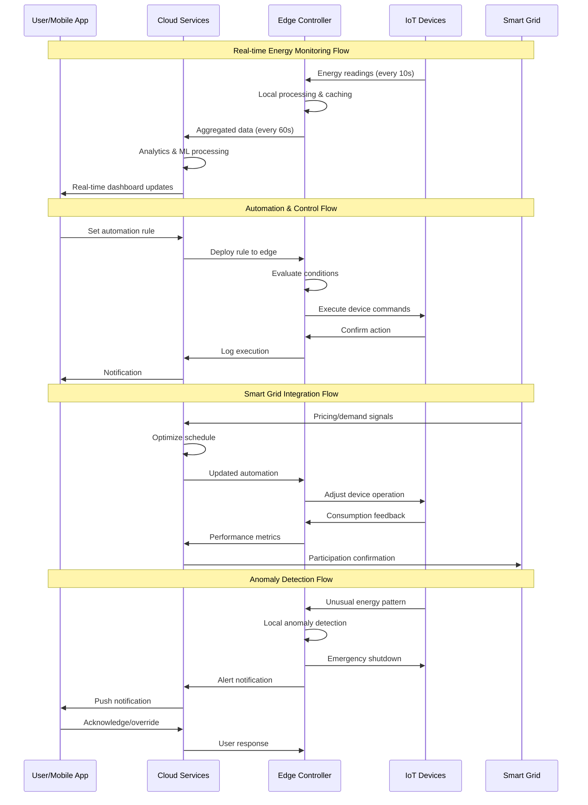
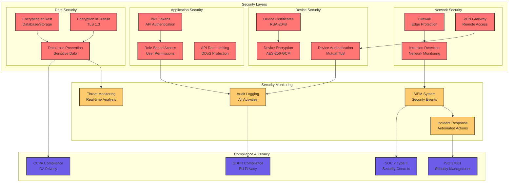
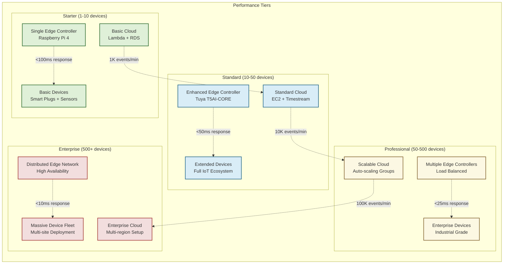
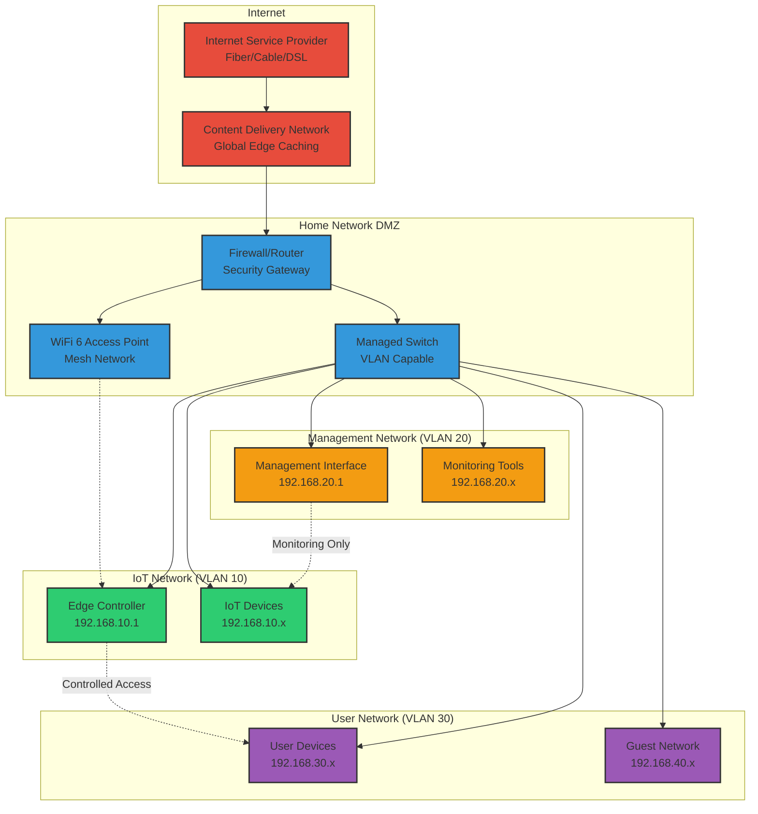

# Smart Energy Copilot - System Architecture Diagram

## 🏗️ Complete System Architecture

```mermaid
graph TB
    subgraph "User Interface Layer"
        MA[Mobile App<br/>iOS/Android]
        WD[Web Dashboard<br/>React/Vue]
        VA[Voice Assistant<br/>Alexa/Google]
        SD[Smart Display<br/>Wall Mount]
    end

    subgraph "Cloud Infrastructure - AWS"
        subgraph "API Gateway & Load Balancer"
            ALB[Application Load Balancer]
            AG[API Gateway]
        end
        
        subgraph "Compute Services"
            LF[Lambda Functions<br/>Analytics Engine]
            EC2[EC2 Instances<br/>Core Services]
            ECS[ECS Containers<br/>Microservices]
        end
        
        subgraph "Data Storage"
            TS[Timestream<br/>Time-Series Data]
            RDS[RDS PostgreSQL<br/>Relational Data]
            S3[S3 Buckets<br/>ML Models & Logs]
            EC[ElastiCache<br/>Redis Cache]
        end
        
        subgraph "AI/ML Services"
            SM[SageMaker<br/>ML Training]
            CF[CloudFormation<br/>Infrastructure]
            CW[CloudWatch<br/>Monitoring]
        end
        
        subgraph "IoT & Security"
            IOT[IoT Core<br/>Device Management]
            CM[Certificate Manager<br/>SSL/TLS]
            IAM[IAM<br/>Access Control]
            KMS[KMS<br/>Encryption Keys]
        end
    end

    subgraph "Edge Computing Layer"
        subgraph "Primary Edge Controller"
            T5AI[Tuya T5AI-CORE<br/>ARM Cortex-A55<br/>2GB RAM, NPU]
            RPI[Raspberry Pi 4<br/>Alternative Option<br/>4GB RAM]
            JN[NVIDIA Jetson Nano<br/>High Performance<br/>GPU Acceleration]
        end
        
        subgraph "Edge Services"
            EM[Energy Monitor<br/>Real-time Processing]
            OD[Occupancy Detector<br/>Computer Vision]
            VAS[Voice Assistant<br/>Speech Recognition]
            AD[Anomaly Detector<br/>ML Inference]
            SE[Schedule Executor<br/>Automation Engine]
            BLE[Behavior Learning<br/>Pattern Analysis]
            ARE[Automation Rules<br/>Complex Logic]
        end
        
        subgraph "Local Storage & Cache"
            LCD[Local Cache<br/>24hr Data Buffer]
            CQ[Command Queue<br/>Offline Operations]
            LDB[Local Database<br/>SQLite/LevelDB]
        end
    end

    subgraph "Network Infrastructure"
        subgraph "Home Network"
            RT[WiFi 6 Router<br/>Mesh Network]
            SW[Ethernet Switch<br/>Gigabit]
            UPS[UPS System<br/>Power Backup]
        end
        
        subgraph "Connectivity Protocols"
            WIFI[WiFi 2.4/5GHz]
            ZB[Zigbee 3.0]
            BT[Bluetooth 5.2]
            ETH[Ethernet]
            MQTT[MQTT Protocol]
            HTTPS[HTTPS/TLS]
        end
    end

    subgraph "Smart Grid Integration"
        subgraph "Utility Services"
            GP[Grid Pricing API<br/>Dynamic Rates]
            DR[Demand Response<br/>Grid Events]
            CI[Carbon Intensity<br/>Real-time Data]
        end
        
        subgraph "Energy Trading"
            P2P[P2P Energy Market<br/>Blockchain]
            RE[Renewable Sources<br/>Solar/Wind/Battery]
            ES[Energy Storage<br/>Home Batteries]
        end
    end

    subgraph "IoT Device Ecosystem"
        subgraph "Energy Monitoring"
            WEM[Whole-Home Monitor<br/>Main Panel]
            CLM[Circuit Monitors<br/>Individual Circuits]
            SP[Smart Plugs<br/>Device Level]
        end
        
        subgraph "HVAC & Climate"
            ST[Smart Thermostat<br/>Temperature Control]
            THS[Temp/Humidity Sensors<br/>Room Level]
            AQM[Air Quality Monitor<br/>PM2.5, CO2, VOC]
        end
        
        subgraph "Lighting & Controls"
            SL[Smart LED Bulbs<br/>Dimming/Color]
            SLS[Smart Light Switches<br/>Wall Mounted]
            MS[Motion Sensors<br/>PIR/Microwave]
        end
        
        subgraph "Security & Monitoring"
            SC[Smart Cameras<br/>AI Person Detection]
            DS[Door/Window Sensors<br/>Entry Monitoring]
            SS[Smoke/CO Detectors<br/>Safety Monitoring]
        end
        
        subgraph "Appliances & Outlets"
            SA[Smart Appliances<br/>Washer/Dryer/Fridge]
            SO[Smart Outlets<br/>High Power Devices]
            WL[Water Leak Sensors<br/>Flood Prevention]
        end
    end

    subgraph "External Integrations"
        subgraph "Weather Services"
            WS[Weather API<br/>OpenWeather/AccuWeather]
            WF[Weather Forecast<br/>7-day Predictions]
        end
        
        subgraph "Utility Integration"
            UI[Utility APIs<br/>Billing Data]
            SM_EXT[Smart Meters<br/>AMI Integration]
        end
        
        subgraph "Third-Party Services"
            IFTTT[IFTTT Integration<br/>Automation Platform]
            HA[Home Assistant<br/>Open Source Hub]
            ALEXA[Amazon Alexa<br/>Voice Control]
            GOOGLE[Google Assistant<br/>Voice Control]
        end
    end

    %% User Interface Connections
    MA --> AG
    WD --> AG
    VA --> AG
    SD --> AG

    %% API Gateway Connections
    AG --> ALB
    ALB --> LF
    ALB --> EC2
    ALB --> ECS

    %% Cloud Service Connections
    LF --> TS
    LF --> RDS
    LF --> S3
    LF --> EC
    EC2 --> TS
    EC2 --> RDS
    ECS --> TS
    
    %% AI/ML Connections
    SM --> S3
    LF --> SM
    CW --> LF
    CW --> EC2

    %% IoT & Security Connections
    IOT --> T5AI
    IOT --> RPI
    IOT --> JN
    CM --> AG
    IAM --> LF
    KMS --> RDS

    %% Edge Controller Connections
    T5AI --> EM
    T5AI --> OD
    T5AI --> VAS
    T5AI --> AD
    T5AI --> SE
    T5AI --> BLE
    T5AI --> ARE
    
    %% Edge Storage Connections
    EM --> LCD
    SE --> CQ
    BLE --> LDB

    %% Network Connections
    T5AI --> RT
    RT --> SW
    SW --> UPS
    T5AI -.-> WIFI
    T5AI -.-> ZB
    T5AI -.-> BT
    T5AI -.-> ETH
    T5AI -.-> MQTT
    T5AI -.-> HTTPS

    %% Smart Grid Connections
    LF --> GP
    LF --> DR
    LF --> CI
    EC2 --> P2P
    T5AI --> RE
    T5AI --> ES

    %% IoT Device Connections
    T5AI --> WEM
    T5AI --> CLM
    T5AI --> SP
    T5AI --> ST
    T5AI --> THS
    T5AI --> AQM
    T5AI --> SL
    T5AI --> SLS
    T5AI --> MS
    T5AI --> SC
    T5AI --> DS
    T5AI --> SS
    T5AI --> SA
    T5AI --> SO
    T5AI --> WL

    %% External Integration Connections
    LF --> WS
    LF --> WF
    EC2 --> UI
    EC2 --> SM_EXT
    AG --> IFTTT
    AG --> HA
    VAS --> ALEXA
    VAS --> GOOGLE

    %% Styling
    classDef cloudService fill:#ff9999,stroke:#333,stroke-width:2px
    classDef edgeDevice fill:#99ccff,stroke:#333,stroke-width:2px
    classDef iotDevice fill:#99ff99,stroke:#333,stroke-width:2px
    classDef userInterface fill:#ffcc99,stroke:#333,stroke-width:2px
    classDef network fill:#cc99ff,stroke:#333,stroke-width:2px
    classDef external fill:#ffff99,stroke:#333,stroke-width:2px

    class LF,EC2,ECS,TS,RDS,S3,EC,SM,IOT,CM,IAM,KMS cloudService
    class T5AI,RPI,JN,EM,OD,VAS,AD,SE,BLE,ARE,LCD,CQ,LDB edgeDevice
    class WEM,CLM,SP,ST,THS,AQM,SL,SLS,MS,SC,DS,SS,SA,SO,WL iotDevice
    class MA,WD,VA,SD userInterface
    class RT,SW,UPS,WIFI,ZB,BT,ETH,MQTT,HTTPS network
    class GP,DR,CI,P2P,RE,ES,WS,WF,UI,SM_EXT,IFTTT,HA,ALEXA,GOOGLE external
```

## 🔄 Data Flow Architecture

## 🏠 Physical Deployment Architecture

```mermaid
graph TB
    subgraph "Electrical Panel"
        MP[Main Panel<br/>200A Service]
        WEM[Whole-Home Monitor<br/>Current Transformers]
        CLM1[Circuit Monitor 1<br/>HVAC]
        CLM2[Circuit Monitor 2<br/>Kitchen]
        CLM3[Circuit Monitor 3<br/>Living Room]
    end

    subgraph "Living Room"
        EC[Edge Controller<br/>Tuya T5AI-CORE]
        RT[WiFi 6 Router<br/>Mesh Node]
        SC1[Smart Camera<br/>Occupancy Detection]
        ST[Smart Thermostat<br/>Climate Control]
        SL1[Smart Lights<br/>LED Bulbs]
        SP1[Smart Plugs<br/>Entertainment Center]
    end

    subgraph "Kitchen"
        MS1[Motion Sensor<br/>PIR Detection]
        SLS1[Smart Light Switch<br/>Under-cabinet LED]
        SP2[Smart Plug<br/>Coffee Maker]
        SP3[Smart Plug<br/>Microwave]
        AQM1[Air Quality Monitor<br/>Cooking Fumes]
    end

    subgraph "Bedrooms"
        THS1[Temp/Humidity Sensor<br/>Master Bedroom]
        SL2[Smart Lights<br/>Bedside Lamps]
        SP4[Smart Plug<br/>Phone Charger]
        MS2[Motion Sensor<br/>Hallway]
    end

    subgraph "Utility Room"
        UPS[UPS System<br/>Battery Backup]
        SW[Network Switch<br/>Ethernet Hub]
        WL1[Water Leak Sensor<br/>Water Heater]
        SP5[Smart Plug<br/>Washer/Dryer]
    end

    subgraph "Outdoor"
        WS[Weather Station<br/>Temp/Wind/Rain]
        SC2[Security Camera<br/>Perimeter Monitoring]
        SL3[Smart Outdoor Lights<br/>Motion Activated]
    end

    %% Power Connections
    MP --> WEM
    MP --> CLM1
    MP --> CLM2
    MP --> CLM3
    MP --> UPS
    UPS --> EC
    UPS --> RT

    %% Network Connections
    EC --> RT
    RT --> SW
    SW -.-> SC1
    SW -.-> SC2

    %% Wireless Connections
    EC -.-> ST
    EC -.-> SL1
    EC -.-> SP1
    EC -.-> MS1
    EC -.-> SLS1
    EC -.-> SP2
    EC -.-> SP3
    EC -.-> AQM1
    EC -.-> THS1
    EC -.-> SL2
    EC -.-> SP4
    EC -.-> MS2
    EC -.-> WL1
    EC -.-> SP5
    EC -.-> WS
    EC -.-> SL3

    %% Monitoring Connections
    WEM -.-> EC
    CLM1 -.-> EC
    CLM2 -.-> EC
    CLM3 -.-> EC

    %% Styling
    classDef electrical fill:#ff6b6b,stroke:#333,stroke-width:2px
    classDef network fill:#4ecdc4,stroke:#333,stroke-width:2px
    classDef sensor fill:#45b7d1,stroke:#333,stroke-width:2px
    classDef control fill:#96ceb4,stroke:#333,stroke-width:2px
    classDef power fill:#feca57,stroke:#333,stroke-width:2px

    class MP,WEM,CLM1,CLM2,CLM3 electrical
    class EC,RT,SW,SC1,SC2 network
    class MS1,MS2,THS1,AQM1,WL1,WS sensor
    class ST,SL1,SL2,SL3,SLS1,SP1,SP2,SP3,SP4,SP5 control
    class UPS power
```

## 🔐 Security Architecture

## 📊 Performance & Scalability Architecture

## 🌐 Network Topology

---

## 📋 Architecture Summary

### Key Architectural Principles

1. **Edge-First Computing**: Critical processing happens locally for low latency and reliability
2. **Cloud-Enhanced Analytics**: Advanced ML and long-term storage in the cloud
3. **Layered Security**: Multiple security layers from device to cloud
4. **Scalable Design**: Architecture scales from home to enterprise deployments
5. **Resilient Operations**: System continues operating during network outages
6. **Privacy by Design**: Sensitive data processed locally when possible

### Performance Characteristics

- **Edge Response Time**: <50ms for device control
- **Cloud Analytics**: <500ms for complex queries
- **Data Throughput**: 100K+ events per minute
- **Device Capacity**: 10,000+ devices per installation
- **Uptime Target**: 99.9% availability

### Security Features

- **End-to-End Encryption**: AES-256-GCM for all sensitive data
- **Certificate-Based Auth**: RSA-2048 device certificates
- **Network Segmentation**: Isolated VLANs for different device types
- **Real-time Monitoring**: Continuous security event analysis
- **Compliance Ready**: GDPR, CCPA, SOC 2, ISO 27001

This architecture provides a robust, scalable, and secure foundation for the Smart Energy Copilot system, supporting everything from small residential installations to large enterprise deployments.